<div align="center">

# FileMind

**Local Intelligence for Your Files**  
*A privacy-first, local-only Windows desktop application for intelligent file search, grounded AI chat, and cross-file knowledge extraction.*

[](LICENSE)
[](https://github.com)
[](docs/architecture.md)
[](docs/architecture.md)

</div>

---

## Overview

**FileMind** transforms your local files and folders into an intelligent, searchable, and conversational local knowledge base.

Unlike cloud-based tools that require uploading your private documents to external servers, FileMind operates **100% on your local machine**. It indexes your files once, extracts structured hierarchical knowledge, and allows you to search, chat, and compare documents anytime—even completely offline.

> **Core Invariant**: *Your files on disk remain the single authoritative source of truth. FileMind never modifies, relocates, or locks your original files.*

---

## Key Features

- **100% Local-First Privacy**: Zero cloud uploads, zero telemetry, and zero external API dependencies for core indexing, vector search, and reranking.
- **Multi-Stage Hybrid Search (Ctrl + K)**: Combines SQLite FTS5 BM25 lexical search and `sqlite-vec` dense embeddings via Reciprocal Rank Fusion (RRF), with optional cross-encoder neural reranking and mutation-invalidated query caching.
- **Grounded Multi-Turn Chat (Ctrl + J)**: Ask natural language questions across your documents. Answers are strictly constrained to retrieved evidence, include multi-turn conversational memory, and feature interactive provenance citations.
- **Granular Chat Scopes**:
  - **All Files**: Query across your entire indexed document library.
  - **Folder Scope**: Restrict conversations strictly to a specific project or directory.
  - **File Scope**: Conduct deep single-document question answering and analysis.
- **Cross-File Intelligence & Synthesis**:
  - **Document Comparison**: Compare 2 to 5 documents side-by-side across key dimensions with grounded matrix scoring.
  - **Multi-File Synthesis**: Synthesize themes, decisions, and insights across up to 10 files using batch retrieval.
  - **Corpus Overview**: View dominant topics, semantic document clusters, and recent insights across all indexed folders.
- **Interactive Citations & Evidence Inspector**: Every AI answer links directly to the exact file, page number, spreadsheet tab, slide number, section heading, line span, or audio/video timestamp.
- **Real-Time Filesystem Watching**: Automatically detects new, modified, renamed, or deleted files in tracked folders with debounced background indexing.
- **Evidence & Transcript Export**: Export chat sessions and research findings in formatted Markdown (with footnote citations), structured JSON, or plain text.
- **Local Model Management**: Compatible with local Ollama models (`llama3.2`, `mistral`, `gemma2`, `phi3`, etc.) with automatic offline degradation.

---

## Architecture

```mermaid
flowchart TD
    %% Styling Definitions
    classDef userNode fill:#f5f3ff,stroke:#7c3aed,stroke-width:2px,color:#1e1b4b,font-weight:bold;
    classDef rectNode fill:#f3e8ff,stroke:#c084fc,stroke-width:1.5px,color:#1e1b4b;
    classDef dbNode fill:#ede9fe,stroke:#9333ea,stroke-width:2px,color:#1e1b4b,font-weight:bold;
    classDef decisionNode fill:#faf5ff,stroke:#a855f7,stroke-width:1.5px,color:#1e1b4b,font-weight:bold;
    classDef offlineNode fill:#fff1f2,stroke:#f43f5e,stroke-width:1.5px,color:#881337;
    classDef branchTitle fill:#e9d5ff,stroke:#7e22ce,stroke-width:1.5px,color:#3b0764,font-weight:bold;

    %% Ingestion Pipeline
    User(["User"]):::userNode
    User -->|Selects folders & files| FS["Local File System<br/><small>Documents • Spreadsheets • Media • Code</small>"]:::rectNode
    FS --> Discovery["File Discovery & Watcher<br/><small>Scan • Create • Modify • Rename • Delete</small>"]:::rectNode
    Discovery --> FormatDet["Multi-Format Detection<br/><small>Magic Bytes • Extension • MIME Inspection</small>"]:::rectNode
    FormatDet --> ParserReg["Parser Registry<br/><small>PDF • Office • Spreadsheets • Code • Images • Audio • Video</small>"]:::rectNode
    ParserReg --> ContentExt["Content Extraction<br/><small>Text • Tables • Metadata • OCR • Audio Transcripts</small>"]:::rectNode
    ContentExt --> Provenance["Provenance Tracking<br/><small>File • Page • Section • Line • Sheet • Slide • Timestamp</small>"]:::rectNode
    Provenance --> Normalization["Content Normalization<br/><small>Unified Document Representation</small>"]:::rectNode
    Normalization --> Chunking["Hierarchical Chunking<br/><small>Structure-Aware • Bounded • Context Preserving</small>"]:::rectNode
    Chunking --> KnowledgeBase[("Persistent Local Knowledge Base<br/><b>SQLite + FTS5 + sqlite-vec</b><br/><small>Metadata • Chunks • Embeddings • Provenance</small>")]:::dbNode

    %% Retrieval Pipeline
    UserQuery(["User Query<br/><small>Search / Ask / Chat</small>"]):::userNode
    UserQuery --> QueryProc["Query Processing<br/><small>Intent • Scope • Filters • Context</small>"]:::rectNode
    QueryProc --> HybridRet["Hybrid Retrieval<br/><small>BM25 Lexical + Dense Vectors + RRF Fusion</small>"]:::rectNode
    KnowledgeBase -.->|Index probe & vectors| HybridRet
    HybridRet --> Reranker["Cross-Encoder Reranking<br/><small>Top Candidate Refinement (Quality Mode)</small>"]:::rectNode
    Reranker --> Assembly["Evidence Assembly<br/><small>Relevant Chunks + Context Budget Accounting</small>"]:::rectNode
    Assembly --> EvidenceVal{"Evidence Valid?"}:::decisionNode

    EvidenceVal -->|No / Unsupported| RejectEvidence["Filter / Reject Irrelevant Chunks"]:::rectNode
    RejectEvidence --> HybridRet
    EvidenceVal -->|Yes| LocalAI(["Local AI Generation<br/><b>Ollama • Local LLM</b>"]):::dbNode

    %% Offline Fallback
    LocalAI -.->|Ollama Offline / Missing| OfflineState["Offline / Model Unavailable State<br/><small>Graceful Fallback</small>"]:::offlineNode
    OfflineState --> UIOutput

    LocalAI --> GroundedAns["Grounded Answer<br/><small>Evidence-Constrained Generation</small>"]:::rectNode
    GroundedAns --> Citations["Interactive Citations<br/><small>Source File • Page • Sheet • Slide • Section • Line • Timestamp</small>"]:::rectNode
    Citations --> UIOutput(["User Output<br/><small>Search Result • Grounded Answer • Verified Evidence</small>"]):::userNode

    %% Chat Scope Branch
    UserQuery --> ChatBranch["Chat Workspace"]:::branchTitle
    ChatBranch --> ConvHist["Conversation History<br/><small>Persistent Multi-Turn Threads</small>"]:::rectNode
    ConvHist --> ScopeDecision{"Chat Scope?"}:::decisionNode
    ScopeDecision -->|ALL| ScopeAll["Entire Indexed Corpus"]:::rectNode
    ScopeDecision -->|FOLDER| ScopeFolder["Selected Folder Only"]:::rectNode
    ScopeDecision -->|FILE| ScopeFile["Selected File Only"]:::rectNode
    ScopeAll --> ScopedRet["Scoped Hybrid Retrieval"]:::rectNode
    ScopeFolder --> ScopedRet
    ScopeFile --> ScopedRet
    ScopedRet --> LocalAI
```



For detailed architectural specifications, see [docs/architecture.md](docs/architecture.md).

---

## Supported File Formats

FileMind includes built-in, structure-aware extractors across documents, spreadsheets, source code, images, audio, and video:

| Category | Extensions | Extracted Features & Intelligence |
| :--- | :--- | :--- |
| **PDF Documents** | `.pdf` | Multi-page text streams, visual headings (`H1 > H2`), table detection, page numbers, and bounding coordinates |
| **Word Documents** | `.docx`, `.doc` | Modern DOCX headings, styled paragraphs, tables, document metadata; legacy DOC binary stream extraction with memory bounds |
| **Presentations** | `.pptx`, `.ppt` | Slide titles, slide numbers, body hierarchy, speaker notes; legacy PPT binary stream extraction |
| **Spreadsheets** | `.xlsx`, `.xls`, `.csv`, `.tsv` | Multi-sheet inspection, structured tabular rows and columns, headers, cell values, and CSV/TSV delimiters |
| **Structured Data & Web** | `.json`, `.xml`, `.html`, `.htm`, `.rtf` | JSON key-value trees, safe XML parsing (XXE protected), semantic HTML DOM extraction, RTF control-word stripping & unicode decoding |
| **Markdown & Plain Text** | `.md`, `.markdown`, `.txt`, `.log` | Heading hierarchies, code fences, blockquotes, lists, and line span provenance |
| **Source Code & Config** | `.py`, `.ts`, `.tsx`, `.js`, `.jsx`, `.rs`, `.go`, `.c`, `.cpp`, `.h`, `.hpp`, `.java`, `.sql`, `.sh`, `.bat`, `.ps1`, `.css`, `.yaml`, `.yml`, `.toml`, `.ini`, `.cfg` | Indentation-aware syntax preservation, function and class definitions, comments, and configuration key-values |
| **Images** | `.png`, `.jpg`, `.jpeg`, `.webp`, `.bmp`, `.tiff`, `.tif`, `.ico`, `.svg` | Dimensions, color modes, EXIF metadata, defused SVG XML parsing, local OCR text extraction, optional local vision model descriptions |
| **Audio Media** | `.mp3`, `.wav`, `.m4a`, `.flac`, `.ogg`, `.aac`, `.wma` | Header inspection, duration, sample rate, channels, and local Whisper / Faster-Whisper timestamped transcript segments |
| **Video Media** | `.mp4`, `.mkv`, `.mov`, `.avi`, `.webm`, `.wmv` | MP4/MKV container metadata, duration, video resolution, and audio track transcription segments with time-range provenance |

---

## Local AI Setup & Requirements

### 1. Built-in Local AI (Zero Configuration Required)
FileMind comes out-of-the-box with embedded local AI engines for search, vector indexing, and neural reranking:
- **Embeddings**: `sentence-transformers/all-MiniLM-L6-v2` via CPU-optimized FastEmbed ONNX Runtime (384 dimensions, vectorized L2 normalization).
- **Reranker**: `ms-marco-MiniLM-L-6-v2` cross-encoder for deep candidate reordering in Quality Mode with bounded context windowing.

### 2. Generative LLM for Chat (Ollama)
For grounded natural language chat, multi-document synthesis, and file comparison, FileMind connects to a local [Ollama](https://ollama.com) instance:

1. **Install Ollama**: Download from [ollama.com](https://ollama.com).
2. **Pull a Model**:
   ```powershell
   ollama pull llama3.2
   ```
3. **Start Ollama**: Ensure Ollama is running (`http://127.0.0.1:11434`).

> *Note: If Ollama is not running, FileMind continues to provide full hybrid search, chunk inspection, and document understanding with graceful offline indicators.*

---

## Installation & Quick Start

### Running the Desktop App

1. Download the latest installer from the Releases page.
2. Launch `FileMind.exe`.
3. In the **Files & Folders** tab, click **+ Add Folder** and select any local folder (e.g., `Documents` or a project directory).
4. FileMind automatically indexes your files in the background.
5. Use **Ctrl + K** to search, or switch to the **Chat Workspace** (**Ctrl + J**) to start asking questions!

---

## Workspaces & User Interface

### 1. Search (Ctrl + K)
- **Instant Multi-Stage Hybrid Search**: Fast lexical BM25 matching combined with dense vector semantic search.
- **Quality Mode Toggle**: Run neural cross-encoder reranking on top candidates for precision research queries.
- **Evidence Inspector**: View source text, confidence score, file path, and exact coordinates.

### 2. Chat Workspace (Ctrl + J)
- **Persistent Threads**: Multi-turn conversations saved locally with deterministic message ordering.
- **Granular Scoping**: Scope conversations to **All Files**, a **Folder**, or a single **File**.
- **Evidence Citations**: Interactive citation badges navigate directly to the exact file, page, slide, sheet, or timestamp.

### 3. Knowledge Workspace
- **Document Comparison**: Compare 2 to 5 documents side-by-side across key dimensions with grounded matrix scoring.
- **Multi-File Synthesis**: Synthesize themes, decisions, and action items across up to 10 files using batch chunk queries.
- **Corpus Overview**: Discover dominant topics, semantic clusters, and recent insights across all indexed folders.

### 4. Settings & Diagnostics
- **Indexing Controls**: Configure file extensions, exclusion patterns, max file size limits, and OCR/Vision toggles.
- **Search Tuning**: Customize top-k candidate limits, RRF weights, and reranker parameters.
- **System Health**: View live database status, storage usage, memory usage, background watcher status, and Ollama connection health.

---

## Development Setup

### Prerequisites
- **Windows 10/11 x64**
- **Python 3.11+**
- **Node.js 18+** & **npm**
- **Rust Toolchain** (`rustc` & `cargo`)

### 1. Clone the Repository
```powershell
git clone https://github.com/ZavedDavdani/FileMind-Local-Intelligence-for-Your-Files.git
cd FileMind-Local-Intelligence-for-Your-Files
```

### 2. Backend Setup
```powershell
cd backend
python -m venv .venv
.\.venv\Scripts\Activate.ps1
pip install -r requirements.txt
```

### 3. Frontend Setup
```powershell
cd ../frontend
npm install
```

### 4. Running the Development Desktop App
```powershell
cd ..
npm run tauri dev
```

---

## Testing & Verification

FileMind includes a comprehensive automated test suite across backend AI pipelines, filesystem watchers, database migrations, and desktop wrappers:

```powershell
# Run the complete backend test suite (700 tests)
pytest backend/tests -q

# Run targeted remediation verification suite (30 tests)
pytest backend/tests/test_remediation_chunk1.py backend/tests/test_remediation_chunk2.py backend/tests/test_remediation_chunk3.py backend/tests/test_remediation_chunk4.py backend/tests/test_remediation_chunk5.py -v

# Run frontend typecheck and production build
cd frontend
npm run build

# Verify Tauri Rust shell compilation
cd ../src-tauri
cargo check
```

---

## Privacy & Security

- **Strict Loopback Binding**: The local backend API listens exclusively on `127.0.0.1:24823`. Remote connections are rejected.
- **Process Isolation**: The Python backend is supervised via Windows Job Objects (`KILL_ON_JOB_CLOSE`), ensuring child processes terminate cleanly when the window is closed.
- **Defused XML & Safe Parsing**: XML, SVG, and office formats use entity-expansion protected defused parsers to prevent XXE and billion-laughs vulnerabilities.
- **Path Containment**: File operations and search queries are strictly bounded to registered folders, preventing directory traversal.
- **Prompt Injection Defense**: Retrieved evidence is isolated within untrusted content blocks during LLM prompt assembly.

---

## License

This project is licensed under the [MIT License](LICENSE).
