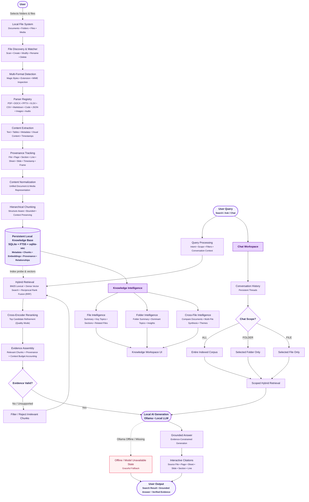

# FileMind — Architecture & System Design

**Local Intelligence for Your Files**  
*Privacy-First Local File Intelligence Architecture*

---

## 1. System Overview & Core Invariants

FileMind is a local-first, privacy-preserving desktop application that transforms user-selected local directories into a structured, searchable, and conversational local knowledge base.

### Core Architectural Invariants

1. **Filesystem Primacy**: The user's files on disk remain the single, authoritative source of truth. FileMind never modifies, relocates, or locks original documents.
2. **100% Local-First Privacy**: All file parsing, lexical indexing, vector embedding, neural reranking, and generative synthesis execute locally on the user's Windows machine. Zero file content or telemetry is ever transmitted off-device.
3. **Deterministic Grounding & Verifiable Citations**: AI responses are strictly bound to retrieved evidence chunks. Every claim is attributed to precise source file coordinates (filename, page, sheet, slide, section, line numbers).
4. **Resilient Local Lifecycle**: The Python backend is supervised by Tauri using Windows Job Objects (`JOB_OBJECT_LIMIT_KILL_ON_JOB_CLOSE`), ensuring clean lifecycle management without orphan processes.

---

## 2. End-to-End System Architecture

---

## 3. Subsystem Breakdown

### 3.1 Filesystem Engine & Change Detection
- **Watcher**: Asynchronous filesystem watcher built with `watchdog` monitoring registered directories on Windows.
- **Debounced Processing**: File events (`CREATE`, `MODIFY`, `DELETE`, `RENAME`) are debounced using sliding time windows to prevent race conditions during rapid writes or bulk copies.
- **Exclusion Filters**: System folders, virtual environments (`.venv`, `node_modules`, `.git`), and user-defined glob patterns are filtered before ingestion.

### 3.2 Multi-Format Parsing & Provenance Extraction
FileMind uses specialized local extractors based on detected file types:
- **PDF Documents**: Structural extraction using PyMuPDF (`fitz`), preserving text streams, page boundaries, tables, and parent heading ancestry (`H1 > H2`).
- **Office Documents**: Microsoft Word (`.docx`), PowerPoint (`.pptx`), and Excel (`.xlsx`) parsers extracting styled paragraphs, slides, sheets, and cell grids.
- **Text & Code**: Markdown, source code files (Python, Rust, TypeScript, C++, Go, etc.), JSON, XML, HTML, and CSV with line-exact tracking.
- **Multimodal Media**: Image metadata/OCR (JPEG, PNG, WebP) and Audio transcription/metadata (MP3, WAV, M4A, FLAC).

### 3.3 Storage Layer & Indexing Engine
- **SQLite Engine**: Embedded database operating in Write-Ahead Logging (`WAL`) mode with `NORMAL` synchronous settings for concurrent read performance.
- **FTS5 Full-Text Search**: BM25-ranked lexical index with `unicode61` tokenizer and trigram support (`files_fts`) for substring and prefix lookup.
- **Vector Search (`sqlite-vec`)**: 384-dimensional vector store populated by `sentence-transformers/all-MiniLM-L6-v2` via FastEmbed ONNX Runtime on CPU.

### 3.4 Multi-Stage Hybrid Retrieval Pipeline
1. **Lexical Retrieval**: Evaluates query terms across the FTS5 full-text index with term frequency and BM25 scoring.
2. **Dense Vector Retrieval**: Computes query embeddings on-device and retrieves top nearest-neighbors via cosine similarity.
3. **Reciprocal Rank Fusion (RRF)**: Merges lexical and vector candidates deterministically:
   $$\text{RRF Score}(d) = \sum_{m \in \{\text{lexical}, \text{dense}\}} \frac{1}{k + r_m(d)} \quad (k = 60)$$
4. **Cross-Encoder Neural Reranking**: In **Quality Mode**, candidate chunks are evaluated with a cross-encoder model (`ms-marco-MiniLM-L-6-v2`) for semantic precision.

### 3.5 Grounded Local Generation & Context Budgeting
- **Strict Token Budgeting (`ContextBudgetConfig`)**: Bounded context allocations prevent silent truncation. System instructions, conversation history, and numbered evidence blocks (`[E1]`, `[E2]`) are budgeted prior to generation.
- **Prompt Injection Defense**: Document chunks are encapsulated within untrusted boundary markers to prevent prompt hijacking.
- **Ollama Provider**: Local loopback client communicating strictly with `http://127.0.0.1:11434`.
- **Citation Validation**: Matches generated citation keys against retrieved chunks to verify provenance and flag any unverified assertions.

### 3.6 Desktop Runtime & Supervision
- **Tauri v2 Desktop Shell**: High-performance Rust desktop frontend hosting the React + TypeScript UI.
- **Win32 Job Object Supervisor**: Windows Job Object management guarantees that when the Tauri application is closed or terminates unexpectedly, the Python backend process is terminated immediately.

### 3.7 Scalability & Hardened Retrieval Subsystems
- **LRU Query Cache with Authoritative Invalidation**: Fast and quality search results are cached in a thread-safe, database-scoped LRU cache (`QueryCache`, default 128 keys). File indexing and deletions automatically clear the cache to ensure instant consistency.
- **Bounded Candidate Overfetch**: BM25 candidate overfetch is bounded within `[50, 200]` candidates, and Cross-Encoder reranking documents are windowed to `2000` characters to prevent CPU memory pressure.
- **Composite Index Claiming**: Database migrations provide composite indexes (`idx_jobs_claim` on `status, priority DESC, created_at ASC` and `idx_jobs_file_status`) for zero-overhead background job claiming.
- **Vectorized Embedding Normalization**: L2 normalization uses NumPy vectorized matrix operations for fast vector search and consistent cosine distance ranking.
- **Resilient Connection Pool Discard**: SQLite pooled connections discard poisoned connections upon rollback failures to protect transactional integrity.

---

## 4. Technology Stack

| Layer | Component | Technology |
| :--- | :--- | :--- |
| **Desktop Shell** | Native Window & Supervision | Tauri 2 (Rust) |
| **Frontend UI** | User Interface & Workspaces | React 18, TypeScript, Tailwind CSS, Lucide Icons |
| **Backend API** | Local REST Services | FastAPI, Uvicorn, Pydantic v2 |
| **Database** | Structured, Lexical & Vector Data | SQLite 3, FTS5, `sqlite-vec` |
| **Embeddings** | Dense Vector Generation | FastEmbed (`all-MiniLM-L6-v2`, ONNX) |
| **Reranking** | Neural Cross-Encoder | `ms-marco-MiniLM-L-6-v2` |
| **Generative LLM** | Local Language Model | Ollama (`llama3.2`, `mistral`, `gemma2`, `phi3`) |
| **Filesystem Watcher**| Change Detection | Python `watchdog` |
| **Caching & Invalidation** | Search Query LRU | In-memory thread-safe `QueryCache` |
